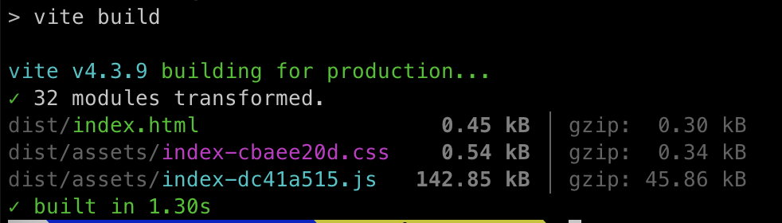
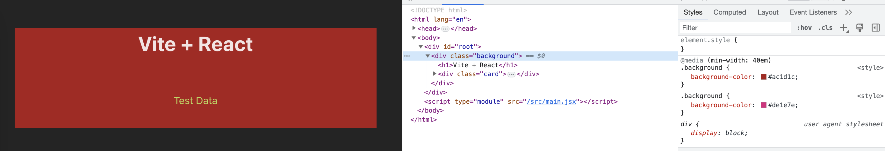

# vite-starter

## Issues

## Resources
- [Vite PostCSS](https://vitejs.dev/config/shared-options.html#css-postcss)
- [Vite PostCSS Nesting](https://stackoverflow.com/questions/71778929/how-to-setup-postcss-nesting-in-vite)
- [Vite PostCSS Custom Media Deprication](https://github.com/csstools/postcss-plugins/issues/531)
- [Custom Media Import Export](https://github.com/csstools/postcss-plugins/issues/531#issuecomment-1354390262)
